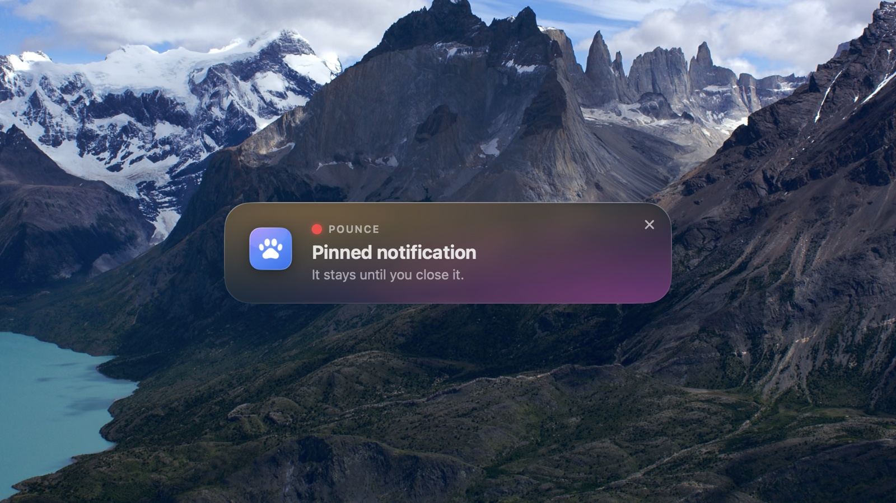

# Pounce — move macOS notifications where you want

[한국어](README.ko.md) · [Website](https://ojtiger.github.io/pounce/)



macOS pins notification banners to the top right corner and offers no setting to change that.
Pounce catches each banner the moment it appears, moves it off screen, and redraws it as a glass
card in the **middle of your screen** — or in whichever of nine spots you pick.

It does not change the notifications themselves. Focus modes, Do Not Disturb, sounds, Notification
Center history and click behaviour all follow the usual macOS rules. Only the position and the look
are different.

- Watches Notification Center's banner windows through the Accessibility API, moves each one away
  before it reaches the screen, then reads its contents.
- A card lives and dies with the banner behind it. Notifications from the same app stack into one card.
- Alerts (the style that stays on screen) are handed back to their usual top-right spot after 10 seconds.
- macOS 26 uses NSGlassEffectView, earlier versions frosted glass. Dark/light mode and the accent
  colour follow the system.
- The menu bar icon can be hidden. Launch Pounce again once it is hidden and the settings window opens.
- It leans on private accessibility structures, so a macOS update can break it. If it breaks, banners
  simply appear at the top right as they always did.

## Install

```sh
brew install --cask ojtiger/tap/pounce
```

Grant Accessibility permission on first launch.

You can also download the latest build from [Releases](https://github.com/ojtiger/pounce/releases/latest),
but the app is signed without notarisation, so macOS blocks that copy on first launch and you have to
approve it in System Settings > Privacy & Security. The Homebrew cask clears that for you.

## Requirements

macOS 14 Sonoma or later, Apple silicon and Intel alike. Free and open source.
