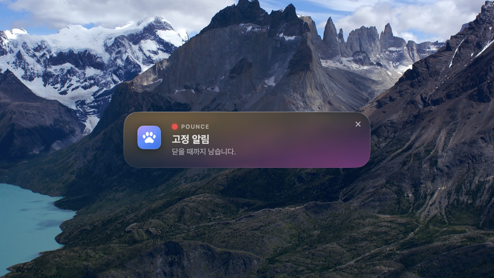

# Pounce — 맥 알림창 위치 변경



macOS 가 우측 상단에 그리는 알림 배너를 그 순간 가로채 **화면 가운데**(또는 아홉 자리 중 고른 곳)에
리퀴드 글래스 카드로 보여줍니다. macOS 는 알림 위치를 바꾸는 설정을 주지 않습니다.

소개 페이지: <https://ojtiger.github.io/pounce/>

알림 자체는 바꾸지 않습니다. 집중 모드, 방해금지, 소리, 알림센터 기록, 클릭 동작 전부 macOS 규칙 그대로이고 위치와 표현만 다릅니다.

- 접근성 API 로 알림센터 배너 창을 감시하고, 화면에 들어오기 전에 치운 뒤 내용을 읽습니다.
- 카드는 원본 배너와 같이 살고 같이 사라집니다. 같은 앱 알림은 카드 하나에 묶입니다.
- 떠 있는 알림("알림" 스타일)은 10초 뒤 우측 상단 제자리로 돌려줍니다.
- macOS 26 은 NSGlassEffectView, 그 이전은 서리 유리. 다크/라이트와 강조 색상은 시스템을 따릅니다.
- 메뉴 막대 아이콘은 숨길 수 있습니다. 숨긴 뒤 Pounce 를 다시 실행하면 설정 창이 열립니다.
- 비공개 접근성 구조에 기대므로 macOS 업데이트 때 깨질 수 있습니다. 깨지면 원래 배너가 그냥 우측 상단에 뜹니다.

## 설치

```sh
brew install --cask ojtiger/tap/pounce
```

첫 실행 때 접근성 권한을 허용해야 합니다.

## 요구 사항

macOS 14 이상, 애플 실리콘·인텔 모두. 무료, 오픈소스.
